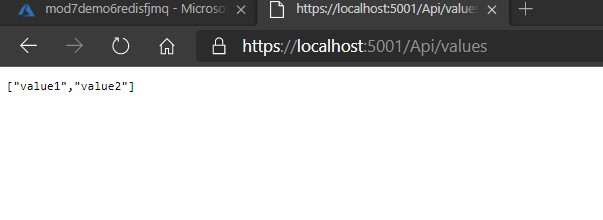
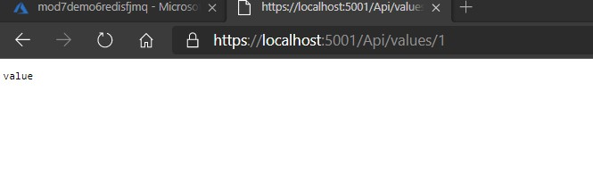
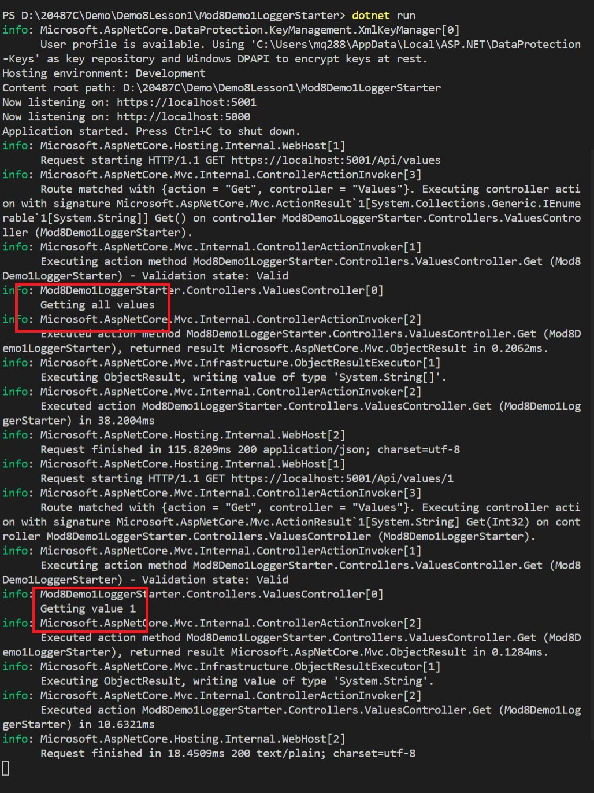

# Lesson 1: Logging in ASP.NET Core

### Demonstration: Recording logs to the Console and EventSource providers

#### Demonstration Steps

- Abrimos el proyecto Mod8Demo1Logger


- En el **Program.cs**, despues de **WebHost.CreateDefaultBuilder(args)**, pegamos despues del metodo **CreateWebHostBuilder** :

  ```cs
   .ConfigureLogging((hostingContext, logging) => 
   {
       logging.AddConsole();
       logging.AddEventSourceLogger();
   })
  ```

- En el **ValuesController.cs** añadimos 

   ```cs
   using Microsoft.Extensions.Logging;
   ```

   ```cs
   private readonly ILogger _logger;
   ```

- añadimos un nuevo constructor

   ```cs
   public ValuesController(ILogger<ValuesController> logger)
   {
       _logger = logger;
   }
   ```

- añadimos en el primer metodo **Get** y antes del return **return**,

   ```cs
   _logger.LogInformation("Getting all values");
   ```

- añadimos en el segundo metodo **Get** y antes del return **return**,

   ```cs
   _logger.LogInformation($"Getting value {id}");
   ```

- ejecutamos

- Probamos en el navegador

   ```url
   https://localhost:5001/api/values
   ```

   

   

   

- Probamos

   ```url
   https://localhost:5001/api/values/1
   ```

   

   

- comprobamos que se recogen los logss

